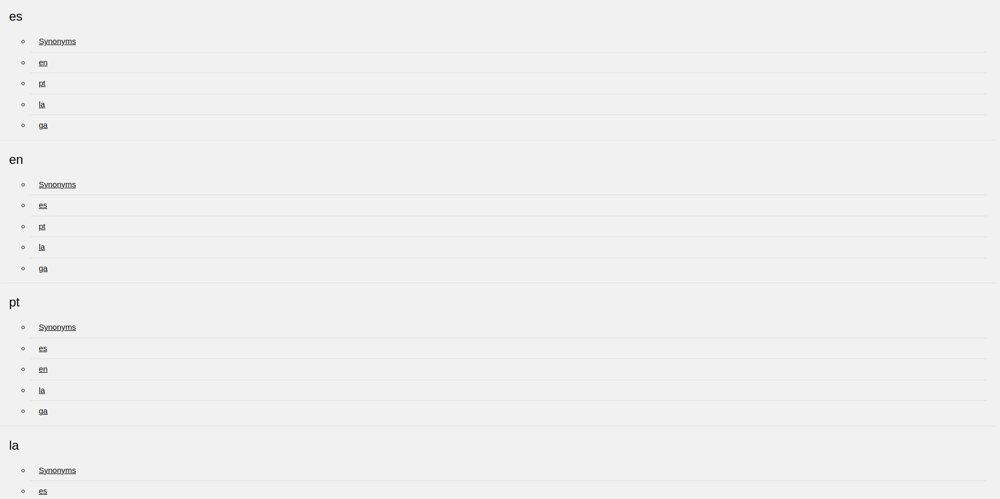
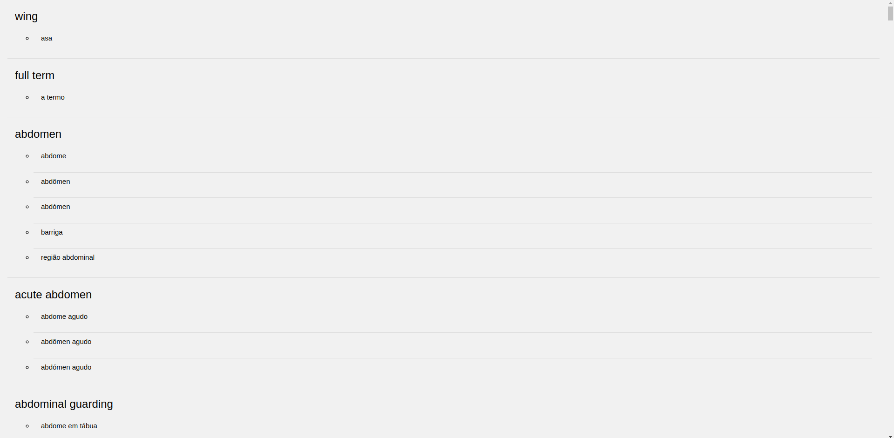

## Grammar 

With the grammar defined in the last homework, now we want to be able to parse the file and create different types of views for it.

## Views

The goal of this phase is to create different kinds of views for the grammar.

### HTML

For the HTML, was done a page for every translation possible (eg.pt-es,es-fr,...) and an index page, that list all these interactions and links to the corresponding page.

The index page:

A page of translation (eg. en-pt):

#### Improvements
To further improve the HTML, we could add a search bar to the index page, so the user can search for a specific word.
And a link on each word for a page for each term with all the attributes of that term.

